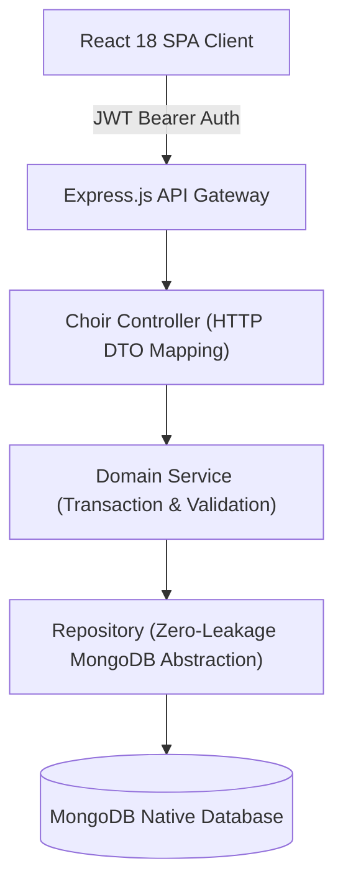

# Documentation & Architectural Writing Standards

> [!IMPORTANT]
> **Trigger Paths**: `case-studies/**/*.md`, `architecture/**/*.md`, `README.md`, `assets/**`
> **When to Read**: MUST be read before drafting or editing case studies, architectural specs, README documents, or embedding visual assets.

## 1. Core Principles

Documentation in `echoir-showcase` serves as an engineering portfolio evaluated by senior engineers, architects, and hiring managers. It must read like an authentic, high-quality engineering publication (such as Stripe, Discord, or Figma engineering blogs)—not an unedited AI generation.

### Authentic Senior Engineering Tone
1. **Zero Decorative Emoji Clutter**:
   - Do **NOT** prepend emojis to markdown headings (`# 🎶`, `## 📌`, `## 🏛️`, `## 🔬`). Headings must be clean and unadorned.
   - Do **NOT** use robotic emoji-prefixed bullet lists (`- 🎼 **Name**:`, `- 🔊 **Name**:`, `📘 [01]`, `📗 [02]`). Use clean standard Markdown lists.
2. **Direct, Plain-Spoken Technical Prose**:
   - Banned AI marketing clichés: *"pioneered"*, *"testament to"*, *"stark dilemma"*, *"holistic"*, *"unwavering commitment"*, *"seamlessly orchestrates"*, *"cutting-edge craftsmanship"*, *"in today's fast-paced landscape"*.
   - Use direct, concrete language. Explain real technical motivations (e.g. replacing lost paper binders and fragmented WhatsApp audio tracks).
   - Accurately frame the project development model: foundational 4-tier layer isolation, concurrency guards, and custom React context were architected and implemented **by hand**, before transitioning to an AI-augmented model for scaling.

### Diagram & Link Invariants
3. **Mermaid Diagram Syntax Invariant**:
   - Every node label in Mermaid flowcharts MUST be enclosed in double quotes: `Node["Description"]`.
   - **Never** place unquoted square brackets `[...]` inside flowchart node shapes (e.g. `Invalidate ['user']` breaks GitHub's parser with `got 'SQS'`).
   - Use standard Mermaid constructs (`flowchart TD`, `flowchart TB`, `sequenceDiagram`, `classDiagram`).
4. **Relative Link Integrity**:
   - All links to other files within the repository must use relative Markdown paths: `[System Architecture](../../architecture/system_overview.md)`.
   - Never use absolute file system paths (e.g. `d:/...` or `C:/...`).
5. **Visual Media & Screenshots**:
   - Embed high-resolution screenshots with centered alignment and width constraints: ``.
   - Provide concise, descriptive caption callouts below each media embed.

---

## 2. Declarative Mermaid Diagram Standard (Golden Pattern)

---

## 3. Anti-Pattern & Pitfall Traps

| Anti-Pattern Trap | Why It Fails | Golden Pattern |
| :--- | :--- | :--- |
| **Emoji Header & Bullet Spam** | Emojis on every heading and bullet point (`# 🎶`, `- 🎼 **Name**:`) instantly look like generic LLM output to recruiters. | Use clean, professional typography with standard Markdown headings and plain bullet points. |
| **AI Marketing Buzzwords** | Inflated claims (*"pioneered a holistic paradigm"*) signal lack of real engineering substance. | Use plain-spoken, concrete technical language: describe actual data structures, latency trade-offs, and failure modes. |
| **Unquoted Mermaid Brackets** | Labels like `Node[Invalidate ['user']]` trigger GitHub parser syntax crashes (`got 'SQS'`). | Always double-quote labels: `Node["Invalidate 'user' query cache"]`. |
| **Hardcoded Absolute OS Paths** | Links like `file:///C:/Users/...` break completely when viewed on GitHub. | Always use relative paths: `[System Overview](../../architecture/system_overview.md)`. |
| **Vague Theoretical Descriptions** | General summaries fail to prove technical depth to interviewers. | Detail specific database indexes, concurrency guards, and algorithm trade-offs. |
| **Broken Markdown Anchors** | Inconsistent header casing or spaces break anchor links in tables of contents. | Verify GitHub anchor slug rules (`#system-architecture`). |
