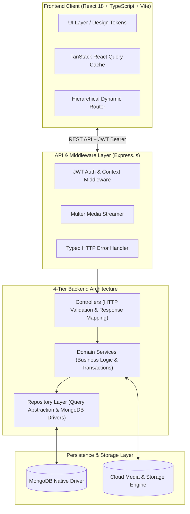
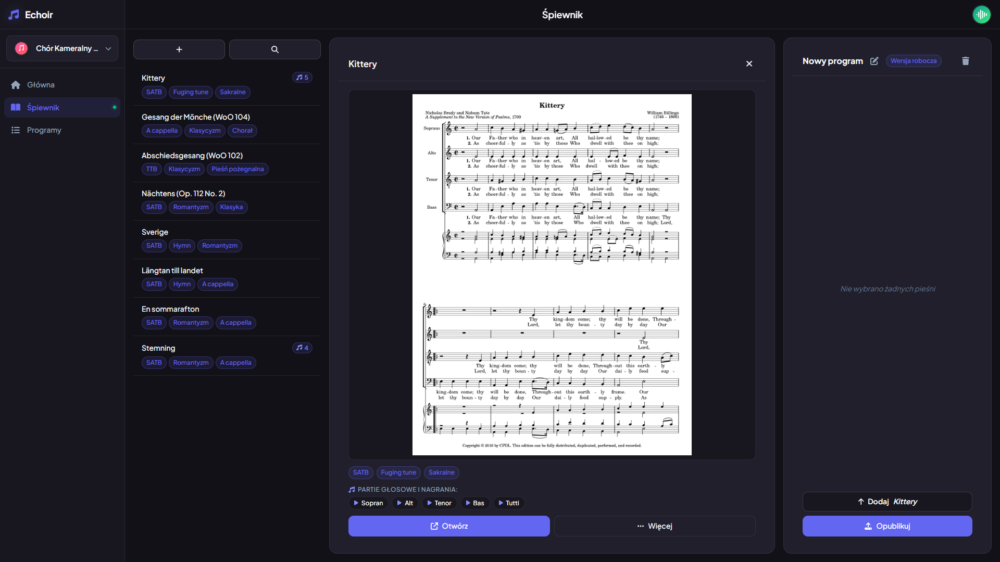
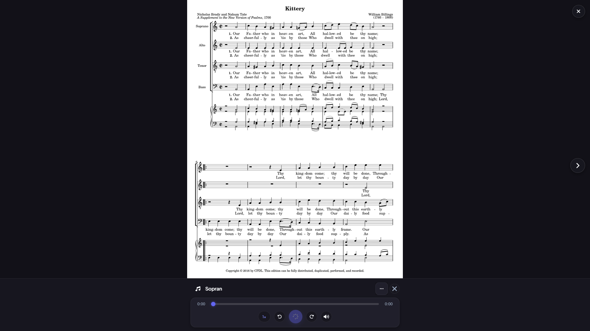
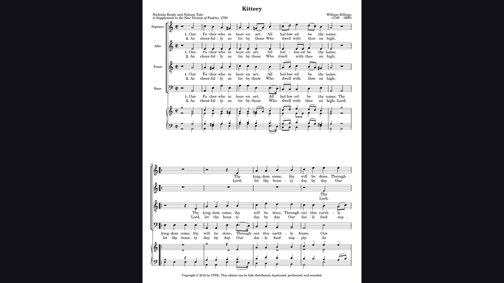
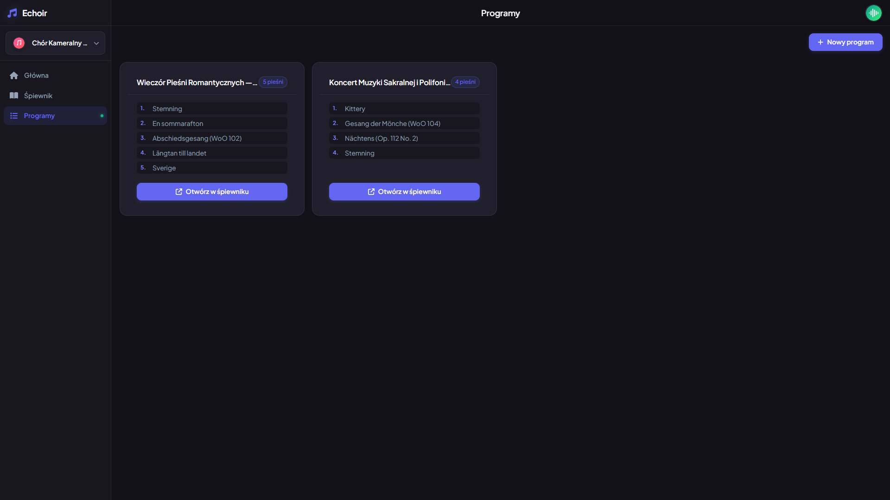
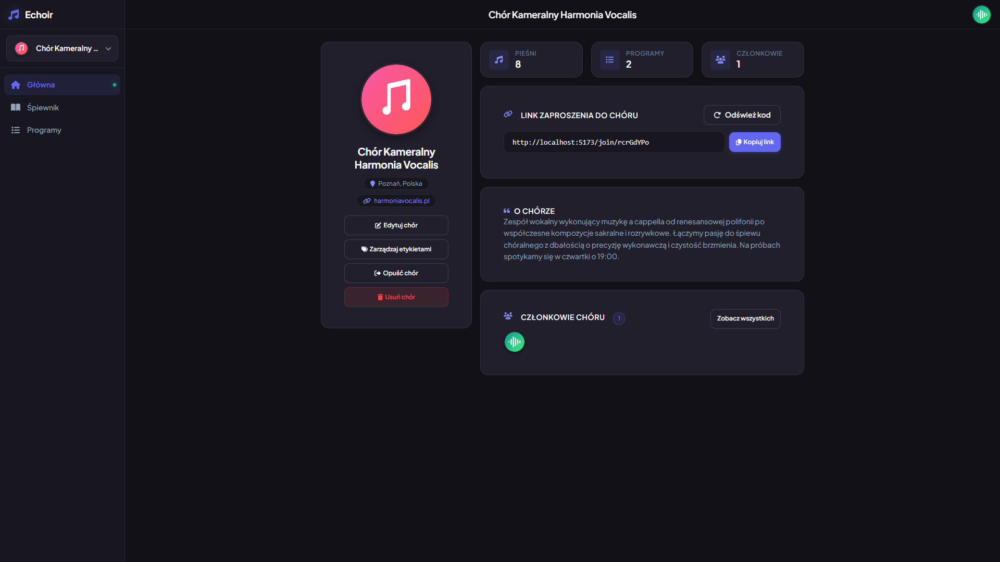
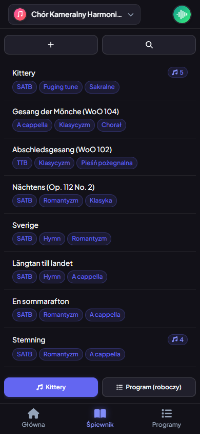

# echoir — System Architecture & Engineering Case Studies

**echoir** is an online digital songbook and collaborative rehearsal platform built for choirs, vocal ensembles, and conductors. It organizes digitized sheet music scores, multi-track voice part audio recordings, personal annotations, and concert setlists into a unified, accessible workspace.

---

## Project Context & Source Code Availability

The core production codebase for **echoir** is maintained in a private repository for intellectual property, security, and future commercialization purposes. This public repository serves as an **architectural proxy and engineering case study** to demonstrate:

- Production system architecture, boundary isolation, and domain modeling.
- Rigorous TypeScript craftsmanship (strict null checks, zero-`any` typing, clean interfaces).
- Concrete solutions to real-world engineering challenges (concurrency, multi-tenancy, resilient routing).
- **AI-Augmented Engineering & Agent Governance**: How hand-crafted foundational architecture transitioned into autonomous AI agent orchestration to accelerate development ~7x while maintaining 100% type safety and zero architectural drift.

> **For Hiring Managers & Technical Interviewers:**  
> A live walkthrough and code demonstration of the full private production repository is available upon request during technical interview stages. Please reach out via the [Contact](#contact--author) section.

---

## Live Production Deployment

The application is deployed and publicly accessible in production:

- **Live URL**: [https://echoir.onrender.com](https://echoir.onrender.com)
- **Sample Ensemble Join Code**: `rcrGdYPo` (or direct link: [https://echoir.onrender.com/join/rcrGdYPo](https://echoir.onrender.com/join/rcrGdYPo))

Feel free to register a test account, browse the repertoire, listen to voice part recordings, or create your own choir workspace.

> **Note on Free-Tier Hosting**: The backend is hosted on Render's free tier. If the instance has been idle, the initial request may take 30–50 seconds while the container spins up. Subsequent requests run at normal speed.

---

## Problem Space & Engineering Philosophy

### The Problem
Traditional choirs and vocal ensembles face fragmented, inefficient rehearsal workflows:
- Physical sheet music binders get damaged, lost, or forgotten.
- Voice part rehearsal tracks are scattered across WhatsApp chats, Google Drives, and email attachments.
- Concert programmes and running orders are tracked in ad-hoc spreadsheets without access to sheet music.

**echoir** consolidates the entire choral workflow into a single responsive web platform:
- **Centralized Repertoire**: Digitized scores with client-side PDF splitting, page rendering, and full-text search.
- **Multi-Track Voice Part Audio**: Isolated stem tracks for Soprano, Alto, Tenor, and Bass with synchronized in-browser playback.
- **Concert Programme Builder**: Drag-and-drop setlist reordering with automatic timing calculations.
- **Multi-Choir Workspaces**: Fast switching between different choirs with isolated repertoires and role permissions.
- **Frictionless Onboarding**: Cryptographic invite links and shareable join codes for rapid singer enrollment.

### Hand-Crafted Foundations, AI-Accelerated Scale
The foundational pillars of **echoir**—the 4-tier MVC/Repository layer isolation, native MongoDB concurrency guards, and custom React context workspace architecture—were designed and implemented completely by hand.

Once these architectural patterns were firmly established, development shifted to an **AI-Augmented Engineering model** using autonomous coding agents (Google Antigravity). By defining strict agent governance rules (`.agents/`), machine-readable path triggers (`acs.yaml`), and mandatory local CI verification gates, feature velocity accelerated dramatically (~7x) with zero degradation in code quality or type safety.

---

## System Architecture

The application is structured as a full-stack monorepo featuring a decoupled, strictly layered backend architecture and a responsive React SPA frontend.

For detailed sequence diagrams and container specifications, see the [System Overview Architecture Document](./architecture/system_overview.md) and [Data Models Specification](./architecture/data_models.md).

---

## Engineering Case Studies

In-depth technical write-ups examining specific architectural challenges, trade-offs, and failure modes solved during development:

| Case Study | Focus Area | Key Concepts |
| :--- | :--- | :--- |
| [**01. Strict 4-Tier Architecture & Layer Isolation**](./case-studies/01-strict-4-tier-architecture.md) | Backend Architecture | Repository Pattern, Zero-Leakage MongoDB Abstraction, Domain vs DB Models, Typed Error Hierarchy |
| [**02. Multi-Choir Workspace Switching & Invitations**](./case-studies/02-multi-choir-context-invitations.md) | Multi-Tenancy & Security | Workspace Context Injection, Cryptographic Invite Tokens, Dynamic Tenant Isolation, Cache Invalidation |
| [**03. Resilient Hierarchical Routing & Self-Healing Slugs**](./case-studies/03-resilient-hierarchical-routing.md) | Frontend & UX Architecture | Diacritic Transliteration, Longest-Prefix Slug Matching, Canonical Fallbacks, Self-Healing URLs |
| [**04. AI-Augmented Systems Engineering & Agent Governance**](./case-studies/04-agentic-engineering-governance.md) | AI Systems & Architecture | Progressive Disclosure, Deterministic Path Triggers, 5-Gate Operational Lifecycle, Upstream Provenance Tracking |

---

## Production Code Extracts

Curated, production-grade code extracts demonstrating coding standards, zero-`any` TypeScript policies, and architectural patterns:

- **Backend Repository Pattern** (`snippets/backend-repository-pattern/`)
  - [`IChoirRepository.ts`](./snippets/backend-repository-pattern/IChoirRepository.ts): Typed interface contract defining database boundaries.
  - [`ChoirRepository.ts`](./snippets/backend-repository-pattern/ChoirRepository.ts): MongoDB native driver encapsulation and atomic aggregations.
  - [`ChoirService.ts`](./snippets/backend-repository-pattern/ChoirService.ts): Business validation, transaction orchestration, and error handling.
- **React Query & Custom Hooks** (`snippets/react-query-and-hooks/`)
  - [`useChoirWorkspace.ts`](./snippets/react-query-and-hooks/useChoirWorkspace.ts): Workspace state provider and dynamic context switching.
  - [`useOptimisticRepertoire.ts`](./snippets/react-query-and-hooks/useOptimisticRepertoire.ts): TanStack Query cache manipulation and optimistic updates.
- **Auth & Invitation Security Pipeline** (`snippets/auth-and-invitation-pipeline/`)
  - [`authMiddleware.ts`](./snippets/auth-and-invitation-pipeline/authMiddleware.ts): JWT verification, token extraction, and request context injection.
  - [`invitationService.ts`](./snippets/auth-and-invitation-pipeline/invitationService.ts): Cryptographic invitation token generation, entropy verification, and redemption logic.
- **AI Agent Governance Framework** (`.agents/`)
  - [`AGENTS.md`](./AGENTS.md): Master entry point and deterministic Rule Routing Matrix (< 140 lines).
  - [`acs.yaml`](./.agents/acs.yaml): Machine-readable Agent Configuration Schema with trigger paths and upstream provenance.
  - [`sync-from-upstream/SKILL.md`](./.agents/skills/sync-from-upstream/SKILL.md): Autonomous workflow for inspecting upstream `echoir` commits and porting architectural changes.

---

## Technology Stack & Engineering Practices

### Frontend (`client/`)
- **Core Framework**: React 18, TypeScript (Strict Mode), Vite
- **Data Fetching & Cache**: `@tanstack/react-query` (declarative key factories and cache invalidation contracts)
- **Routing**: `react-router-dom` v6 with dynamic hierarchical nested routing
- **Interactivity & UI**: `@dnd-kit/core` & `@dnd-kit/sortable` (drag-and-drop setlists), `framer-motion`
- **Styling**: Modular SCSS with design tokens (tonal dark mode, accessible color scales, z-index scale)
- **Document & Media Handling**: `pdfjs-dist`, `jspdf`, Web Audio API

### Backend (`server/`)
- **Runtime & Framework**: Node.js, Express.js, TypeScript
- **Architecture**: Strict 4-Tier MVC/Repository pattern (Routes $\rightarrow$ Controllers $\rightarrow$ Services $\rightarrow$ Repositories)
- **Database**: MongoDB using the native Node.js driver (`mongodb`) with zero ORM overhead
- **Authentication**: JWT (JSON Web Tokens) with `bcrypt` password hashing and Google OAuth integration
- **Media Pipeline**: `multer`, `fluent-ffmpeg`, `archiver`, cloud storage integration

### DevOps & Quality Assurance
- **Monorepo Orchestration**: `npm` workspaces with concurrent development lifecycle
- **Linting & Formatting**: ESLint (TypeScript strict rules), Prettier
- **Continuous Integration**: GitHub Actions automated linting, type-checking, and build verification pipelines
- **Testing**: Vitest / Jest unit test suites for utilities, services, and repositories

### AI-Augmented Engineering & Agent Governance
- **Agent Orchestration**: Autonomous agent pairing governed via progressive disclosure (`AGENTS.md` $\rightarrow$ `.agents/rules/`)
- **Trigger-Based Guardrails**: Machine-readable glob path routing (`acs.yaml`) activating targeted rules per file scope
- **Quality Gates**: 5-phase operational lifecycle requiring interface inspection before coding, zero compiler suppression (`@ts-ignore`), and pre-push local CI verification
- **Provenance Tracking**: Strict upstream commit hash tracking to synchronize architectural milestones from the private repository

---

## Application Interface & Visual Showcase

High-resolution captures from the live production application running with sample repertoire and ensemble data for *Chór Kameralny Harmonia Vocalis*:

### 1. Dual-Pane Repertoire Browser & Score Preview
> Full-text search, multi-category tag filtering (`SATB`, `Romantyzm`, `Sakralne`), score sheet thumbnail rendering, and draft programme drawer.

  

### 2. Multi-Track Voice Part Audio Rehearsal Player
> Isolated stem tracks for Soprano, Alto, Tenor, Bass, and Tutti with real-time waveform scrubbing and playback speed controls.

  

### 3. Full-Screen Sheet Reader & Performance Mode
> Clean, distraction-free score notation rendering designed for choir folders, rehearsal stands, and performance tablets.

  

### 4. Concert Programme Catalog & Setlist Organization
> Curated performance setlists with numbered song sequencing, estimated timings, and one-click songbook loading.

  

### 5. Multi-Tenant Choir Workspace & Dashboard
> Ensemble management hub showcasing membership metrics, cryptographic invitation tokens, and member roster.

  

### 6. Mobile Responsive Shell
> Responsive mobile design with bottom navigation dock, compact repertoire cards, and thumb-accessible quick actions.

  

*(For the complete screenshot inventory and metadata, see the [Screenshot Catalog](./assets/screenshots/README.md).)*

---

## Contact & Author

Created and maintained by **Michał** ([@MichalRedm](https://github.com/MichalRedm)).

- **GitHub**: [@MichalRedm](https://github.com/MichalRedm)
- **Project Role**: Full-Stack Architect & Lead Developer
- **Inquiries**: Feel free to reach out via GitHub issues or profile contact links for technical discussions, architectural deep dives, or employment inquiries.

---

## License

The architectural documentation and code samples in this showcase repository are open-sourced under the [MIT License](./LICENSE).
