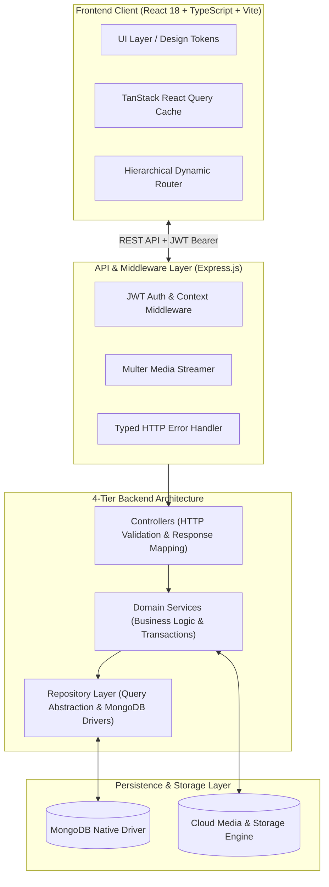

# 🎶 echoir — Showcase & Architecture Case Study

> **echoir** is an online digital songbook and collaborative workspace platform tailored for choirs, vocal ensembles, and conductors. It organizes digitized sheet music, multi-track voice part audio recordings, personalized annotations, and concert programmes in real time.

---

## 📌 Repository Purpose & Intellectual Property Disclaimer

> [!IMPORTANT]
> **This repository is an Architectural Showcase and Engineering Case Study.**
> 
> The proprietary core codebase for **echoir** is maintained in a private repository for intellectual property, security, and future commercialization purposes. This public repository serves as a **public proxy** to demonstrate:
> - Production system architecture & domain modeling
> - High-standard TypeScript craftsmanship and clean-code principles
> - Solutions to real-world engineering hurdles (upload concurrency, multi-tenancy, resilient routing)
> 
> **For Hiring Managers & Technical Interviewers:**
> A full, live IDE code walkthrough and demonstration of the private production repository is available upon request during interview stages. Please reach out via the [Contact](#-contact--author) section.

---

## 📖 Executive Summary & Problem Space

Traditional choirs and vocal ensembles struggle with fragmented rehearsal workflows: physical score binders get worn or misplaced, voice part audio tracks are scattered across cloud drives and messaging apps, and concert setlists are maintained in ad-hoc spreadsheets.

**echoir** consolidates the entire choir workflow into a unified, accessible web platform:
- 🎼 **Centralized Repertoire**: Digitized sheet music with instant PDF score rendering and full-text search.
- 🔊 **Multi-Track Voice Part Audio**: Dedicated recordings per voice part (Soprano, Alto, Tenor, Bass) with synchronized in-browser playback.
- 📋 **Concert Programme Builder**: Drag-and-drop setlist reordering with timing estimations.
- 🏢 **Multi-Choir Workspaces**: Seamless switching between multiple ensembles with isolated repertoires and role permissions.
- 🔗 **Frictionless Onboarding**: Cryptographic invitation links and shareable join codes for instant member enrollment.

---

## 🏛️ System Architecture

`echoir` is built as a full-stack monorepo featuring a decoupled, strictly layered backend architecture and a responsive, token-driven React SPA frontend.

For complete diagrams, sequence charts, and container specifications, read the [System Overview Architecture Document](./architecture/system_overview.md).

---

## 🔬 In-Depth Engineering Case Studies

Explore detailed technical write-ups on specific architectural challenges solved during the development of `echoir`:

| Case Study | Focus Area | Key Concepts |
| :--- | :--- | :--- |
| 📘 [**01. Strict 4-Tier Architecture & Layer Isolation**](./case-studies/01-strict-4-tier-architecture.md) | Backend Architecture | Repository Pattern, Zero-Leakage MongoDB Abstraction, Domain vs DB Models, Typed Error Hierarchy |
| 📗 [**02. Multi-Choir Workspace Switching & Invitations**](./case-studies/02-multi-choir-context-invitations.md) | Multi-Tenancy & Security | Workspace Context Injection, Cryptographic Invite Tokens, Dynamic Tenant Isolation, Cache Invalidation |
| 📙 [**03. Resilient Hierarchical Routing & Self-Healing Slugs**](./case-studies/03-resilient-hierarchical-routing.md) | Frontend & UX Architecture | Diacritic Transliteration, Longest-Prefix Slug Matching, Canonical Fallbacks, Self-Healing URLs |

---

## 💻 Sanitized Code Samples

Curated, production-grade code extracts demonstrating coding standards, zero-`any` TypeScript policies, and robust patterns:

- 📂 [**Backend Repository Pattern**](./snippets/backend-repository-pattern/)
  - [`IChoirRepository.ts`](./snippets/backend-repository-pattern/IChoirRepository.ts): Typed interface contract defining database boundaries.
  - [`ChoirRepository.ts`](./snippets/backend-repository-pattern/ChoirRepository.ts): MongoDB native driver encapsulation and atomic aggregations.
  - [`ChoirService.ts`](./snippets/backend-repository-pattern/ChoirService.ts): Business validation, transaction orchestration, and error throwing.
- 📂 [**React Query & Custom Hooks**](./snippets/react-query-and-hooks/)
  - [`useChoirWorkspace.ts`](./snippets/react-query-and-hooks/useChoirWorkspace.ts): Workspace state provider and dynamic context switching.
  - [`useOptimisticRepertoire.ts`](./snippets/react-query-and-hooks/useOptimisticRepertoire.ts): TanStack Query cache manipulation and optimistic updates.
- 📂 [**Auth & Invitation Security Pipeline**](./snippets/auth-and-invitation-pipeline/)
  - [`authMiddleware.ts`](./snippets/auth-and-invitation-pipeline/authMiddleware.ts): JWT verification, token extraction, and request context injection.
  - [`invitationService.ts`](./snippets/auth-and-invitation-pipeline/invitationService.ts): Cryptographic invitation token generation, entropy verification, and redemption logic.

---

## 🛠️ Technology Stack & Engineering Practices

### Frontend (`client/`)
- **Core Framework**: React 18, TypeScript (Strict Mode), Vite
- **Data Fetching & Cache**: `@tanstack/react-query` (with declarative key factories and query invalidation)
- **Routing**: `react-router-dom` v6 with dynamic hierarchical nested routing
- **Interactivity & UI**: `@dnd-kit/core` & `@dnd-kit/sortable` (drag-and-drop programmes), `framer-motion`
- **Styling**: Modular SCSS with design tokens (tonal dark mode, accessible color scales, z-index hierarchy)
- **Document & Media Handling**: `pdfjs-dist`, `jspdf`, Web Audio API

### Backend (`server/`)
- **Runtime & Framework**: Node.js, Express.js, TypeScript
- **Architecture**: Strict 4-Tier MVC/Repository pattern (Routes $\rightarrow$ Controllers $\rightarrow$ Services $\rightarrow$ Repositories)
- **Database**: MongoDB using the native Node.js driver (`mongodb`) with zero ORM overhead
- **Authentication**: JWT (JSON Web Tokens) with `bcrypt` password hashing and Google SSO provider integration
- **Media Pipeline**: `multer`, `fluent-ffmpeg`, `archiver`, cloud storage integration

### DevOps & Quality Assurance
- **Monorepo Orchestration**: `npm` workspaces with concurrent development lifecycle
- **Linting & Formatting**: ESLint (TypeScript strict rules), Prettier
- **Continuous Integration**: GitHub Actions automated linting, type-checking, and build verification pipelines
- **Testing**: Vitest / Jest unit test suites for utilities, services, and repositories

---

## 🖼️ Visual Walkthroughs & UI Showcase

Explore the production application interface running with sample repertoire and ensemble data for *Chór Kameralny Harmonia Vocalis*:

### 1. Dual-Pane Repertoire Browser & Score Preview
> Rapid full-text search, multi-category tag filtering (`SATB`, `Romantyzm`, `Sakralne`), score sheet thumbnail rendering, and live draft programme drawer.

  

### 2. Multi-Track Voice Part Audio Rehearsal Player
> Dedicated isolated stem tracks for Soprano, Alto, Tenor, Bass, and Tutti with real-time waveform scrubbing and playback speed controls.

  

### 3. Full-Screen Sheet Reader & Performance Mode
> Clean, distraction-free score notation rendering designed for choir folders, rehearsal stands, and performance tablets.

  

### 4. Concert Programme Catalog & Setlist Organization
> Curated performance setlists with numbered song sequencing, estimated timings, and one-click songbook loading.

  

### 5. Multi-Tenant Choir Workspace & Dashboard
> Ensemble management hub showcasing membership metrics, cryptographic invitation tokens, and member roster.

  

### 6. Mobile Responsive Shell
> Responsive mobile design with bottom navigation dock, compact repertoire cards, and thumb-accessible quick actions.

  

*(For the complete screenshot inventory and metadata, see the [Screenshot Catalog](./assets/screenshots/README.md).)*

---

## 📬 Contact & Author

Created and maintained by **Michał** ([@MichalRedm](https://github.com/MichalRedm)).

- **GitHub**: [@MichalRedm](https://github.com/MichalRedm)
- **Project Role**: Full-Stack Architect & Lead Developer
- **Inquiries**: Feel free to reach out via GitHub issues or profile contact links for technical discussions, architectural deep dives, or employment inquiries.

---

## 📄 License

The architectural documentation and code samples in this showcase repository are open-sourced under the [MIT License](./LICENSE).
