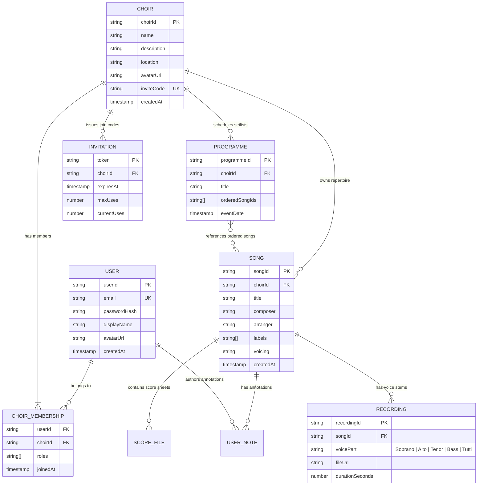

# Data Models & Domain Entity Specifications — echoir

This document outlines the conceptual data models, collection schemas, and entity relationships within **echoir** using MongoDB as the primary document datastore.

---

## 1. High-Level Entity-Relationship (ER) Model



---

## 2. Document Collection Schemas & Data Contracts

### A. `users` Collection
Stores registered user identities and global authentication profiles.
```typescript
interface UserDB {
  _id?: ObjectId;
  userId: string;               // Unique domain user identifier (UUID / NanoID)
  email: string;                // Lowercased, indexed unique email address
  passwordHash?: string;        // Salted bcrypt password hash (omitted for OAuth users)
  googleId?: string;            // Google SSO subject ID
  firstName: string;
  lastName: string;
  avatarUrl?: string;
  createdAt: number;            // Epoch timestamp (ms)
  updatedAt: number;
}
```

### B. `choirs` Collection
Stores ensemble workspace metadata and embedded member associations.
```typescript
interface ChoirDB {
  _id?: ObjectId;
  choirId: string;              // Unique domain workspace identifier
  name: string;                 // Choir name
  description?: string;
  location?: string;
  avatarUrl?: string;
  inviteCode: string;           // Shareable unique 8-character invitation code
  users: Array<{
    userId: string;
    roles: ("admin" | "moderator" | "member")[];
    joinTime: number;
  }>;
  createdAt: number;
  updatedAt: number;
}
```

### C. `songs` Collection
Stores individual score records, sheet music assets, and voice part stems within a choir workspace.
```typescript
interface SongDB {
  _id?: ObjectId;
  songId: string;               // Unique domain song identifier
  choirId: string;              // Multi-tenant partition key (indexed)
  title: string;                // Canonical song title
  composer?: string;
  arranger?: string;
  labels: string[];             // Repertoire tags (e.g. "Advent", "8-Part", "Sacred")
  voicing?: string;             // SATB, SSAA, TTBB, etc.
  scores: Array<{
    scoreId: string;
    pageNumber: number;
    fileUrl: string;
    mimeType: string;
    uploadedAt: number;
  }>;
  recordings: Array<{
    recordingId: string;
    voicePart: "soprano" | "alto" | "tenor" | "bass" | "tutti";
    fileUrl: string;
    duration: number;
    uploadedAt: number;
  }>;
  createdAt: number;
  updatedAt: number;
}
```

### D. `programmes` Collection
Stores concert setlists, event sequences, and song orderings for performance.
```typescript
interface ProgrammeDB {
  _id?: ObjectId;
  programmeId: string;          // Unique domain programme identifier
  choirId: string;              // Multi-tenant partition key
  title: string;                // Concert / Service title
  description?: string;
  eventDate?: number;           // Scheduled performance timestamp
  songs: Array<{
    songId: string;
    orderIndex: number;
    customNote?: string;
  }>;
  createdAt: number;
  updatedAt: number;
}
```

---

## 3. Query Optimization & Indexing Strategy

To maintain sub-millisecond query latency across growing choir workspaces, compound and unique indexes are established:

| Collection | Key Pattern | Index Type | Purpose |
| :--- | :--- | :--- | :--- |
| `users` | `{ email: 1 }` | Unique | Fast authentication lookup & collision prevention |
| `choirs` | `{ choirId: 1 }` | Unique | Primary workspace resolution |
| `choirs` | `{ inviteCode: 1 }` | Unique | O(1) invitation token redemption |
| `choirs` | `{ "users.userId": 1 }` | Standard | Retrieve all workspaces for a given user |
| `songs` | `{ choirId: 1, title: 1 }` | Compound | Fast alphabetical sorting and tenant filtering |
| `songs` | `{ choirId: 1, labels: 1 }` | Multikey | High-speed multi-tag filtering across repertoire |
| `programmes` | `{ choirId: 1, eventDate: -1 }` | Compound | Chronological concert setlist ordering |
