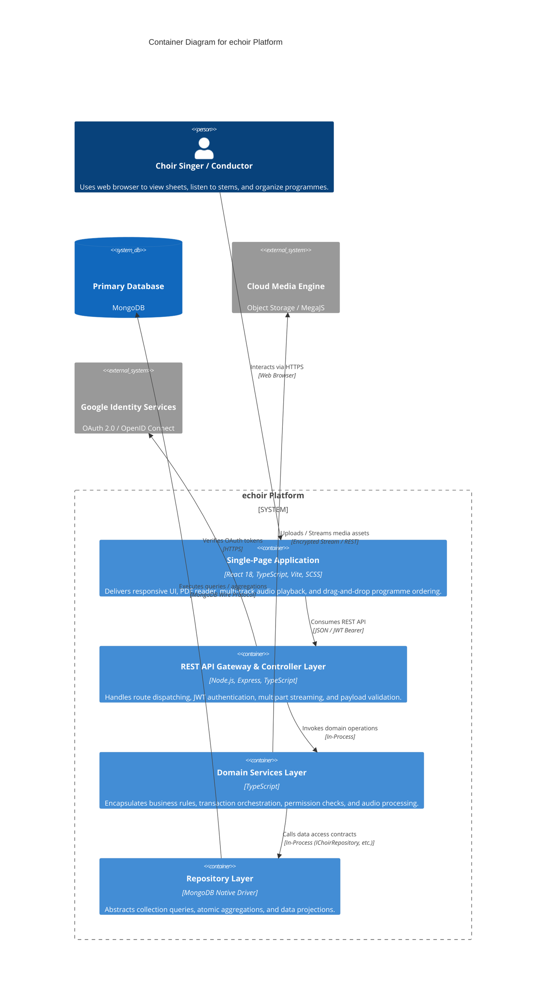
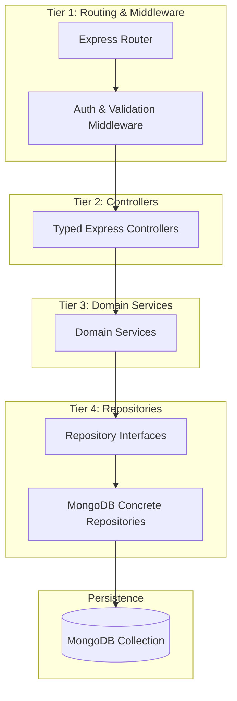
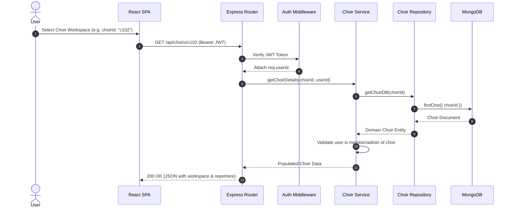
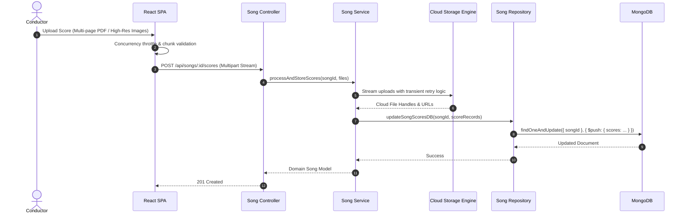

# System Architecture Overview — echoir

This document outlines the architectural topology, container boundaries, layered backend structure, and end-to-end data pipelines powering **echoir**.

---

## 1. High-Level C4 Container Diagram

---

## 2. 4-Tier Backend Architectural Layering

The backend enforces a strict unidirectional separation of concerns across 4 distinct layers:

### Layer Responsibilities & Isolation Rules
1. **Routing & Middleware Tier**:
   - Parses HTTP requests and extracts parameters (`req.params`, `req.query`, `req.body`).
   - Validates session tokens via `authMiddleware` and attaches authenticated user context (`req.userId`, `req.user`).
   - Catches unhandled rejections and maps typed errors (`BadRequestError`, `NotFoundError`, `ForbiddenError`) to HTTP status codes.

2. **Controller Tier**:
   - Strictly responsible for HTTP boundary mapping: unpacking request DTOs and formatting HTTP JSON responses.
   - **Rule**: Controllers *never* execute database queries directly and *never* contain business decision logic.

3. **Domain Service Tier**:
   - Encapsulates domain logic: permission checks, state transitions, unique code generation, audio file transcoding.
   - Orchestrates multi-repository operations and handles transaction rollbacks.
   - **Rule**: Services communicate with data stores exclusively via repository interfaces.

4. **Repository Tier**:
   - Concrete implementations of interface contracts (e.g., `IChoirRepository`, `ISongRepository`).
   - Encapsulates MongoDB native driver collection logic, query operators (`$set`, `$pull`, `$push`, `$facet`), and indexing.
   - **Rule**: Repositories contain *zero* business validation and *zero* HTTP awareness.

---

## 3. End-to-End Data & Media Pipelines

### A. Authentication & Workspace Context Pipeline

### B. Multi-Page Score Upload & Processing Pipeline

---

## 4. Security Architecture

1. **Token-Based Stateless Auth**: JSON Web Tokens signed with HMAC-SHA256 or asymmetric keys, storing minimal claims (`userId`, `email`).
2. **Workspace Isolation**: Every choir-scoped operation validates that the requesting `userId` is an enrolled member with appropriate permissions (`admin`, `moderator`, `user`).
3. **Cryptographic Invitation Tokens**: Invitation links use cryptographically random high-entropy strings, protected against enumeration and replay attacks.
4. **Input Sanitization & Safe Slugs**: URL slugs are transliterated and stripped of non-alphanumeric characters to prevent injection and routing ambiguities.
