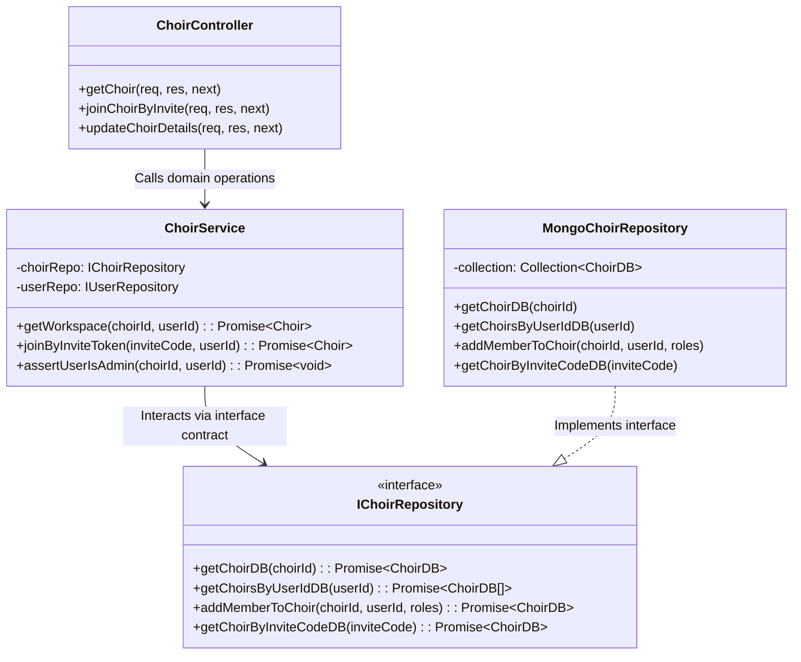

# Engineering Case Study 01: Strict 4-Tier Backend Architecture & Layer Isolation

**Domain**: Backend Architecture & Design Patterns  
**Technologies**: Node.js, Express, TypeScript, MongoDB Native Driver  
**Impact**: 100% decoupling of HTTP transport from business logic and database queries; zero test mocking friction.

---

## 1. Context & The Engineering Challenge

In many Node.js/Express applications, database queries (`db.collection('...').find(...)`) and HTTP request-response mechanics (`res.status(200).json(...)`) frequently bleed across controller functions. This "fat controller" anti-pattern leads to:
1. **Severe tight coupling**: HTTP route handlers are tied to MongoDB query syntaxes.
2. **Untestable business rules**: Validating membership or permission checks requires spinning up a live database or brittle MongoDB mocks.
3. **Inconsistent error handling**: Different endpoints handle validation or not-found cases with ad-hoc status codes and error formats.

For **echoir**, a multi-tenant choir management system with rich domain workflows (file streaming, permission levels, dynamic workspace switching), architectural clean-room boundaries were critical from day one.

---

## 2. The Solution: Strict 4-Tier Separation of Concerns

We instituted a strict unidirectional 4-tier layer isolation pattern:

```
[ Express Route / Middleware ] ──> [ Controller ] ──> [ Domain Service ] ──> [ Repository Interface ] ──> [ MongoDB Native Driver ]
```



---

## 3. Key Architectural Invariants & Patterns

### A. Strict Interface Contracts (`IChoirRepository.ts`)
Domain services never import concrete MongoDB collection utilities. Instead, they depend exclusively on typed repository contracts defined in `repositories/interfaces/`:

```typescript
export interface IChoirRepository {
  getChoirDB(choirId: string): Promise<(ChoirDB & { songs: SongDB[] }) | null>;
  getChoirsByUserIdDB(userId: string): Promise<ChoirDB[]>;
  addMemberToChoir(choirId: string, userId: string, roles?: string[]): Promise<ChoirDB | null>;
  createChoirDB(choir: ChoirDB): Promise<ChoirDB>;
  getChoirByInviteCodeDB(inviteCode: string): Promise<ChoirDB | null>;
  deleteChoirDB(choirId: string): Promise<boolean>;
}
```

### B. Typed Error Hierarchy
Rather than passing error responses in `res.status(400).json(...)`, the service layer throws domain-specific semantic errors inheriting from a base `HttpError`:

```typescript
export class BadRequestError extends HttpError {
  constructor(message = "Bad Request") {
    super(message, 400);
  }
}

export class NotFoundError extends HttpError {
  constructor(message = "Resource Not Found") {
    super(message, 404);
  }
}

export class ForbiddenError extends HttpError {
  constructor(message = "Access Forbidden") {
    super(message, 403);
  }
}
```

A centralized Express error middleware catches these typed errors and formats a uniform JSON payload with correlation timestamps.

### C. Separation of Domain Models from Database Models
- `ChoirDB.ts`: Matches raw MongoDB document shapes (including internal `_id: ObjectId`).
- `Choir.ts` (Domain Entity): Contains sanitized, frontend-ready fields (converting `_id` to string `choirId`, stripping salt/hashes).
- `ChoirAPI.ts`: Response contracts consumed by TanStack Query on the client.

---

## 4. Concrete Benefits & Results

1. **Effortless Unit Testing**: Domain services can be tested with in-memory stub implementations of `IChoirRepository` without connecting to Mongo or running slow container fixtures.
2. **Zero Database Query Leakage**: 100% of MongoDB native driver logic is localized in repository files. If the datastore is migrated or augmented with caching (e.g. Redis), the controllers and services require zero modifications.
3. **Compile-Time Contract Guarantees**: Any mismatch in query parameters (e.g., swapping `userId` and `choirId`) is caught immediately by TypeScript compiler type-checks.
