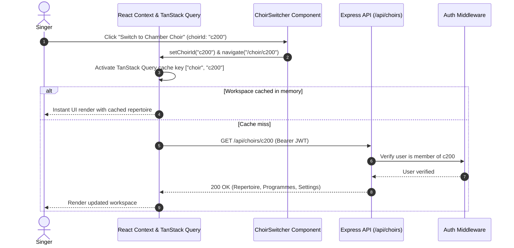

# Engineering Case Study 02: Multi-Tenant Workspace Context Switching & Cryptographic Invitation System

**Domain**: Multi-Tenancy, Security & State Management  
**Technologies**: React 18, React Query, Express.js, TypeScript, Crypto  
**Impact**: Frictionless multi-workspace switching without session renegotiation; secure invitation generation with zero token collisions.

---

## 1. Context & The Problem

Choral singers and conductors frequently participate in multiple choirs simultaneously (e.g. a community chamber ensemble, a church choir, and a university chorus). In traditional platforms, switching between ensembles often requires:
- Re-authenticating or managing separate logins.
- Reloading the full application state, resulting in jarring UX flashes.
- Fragile member onboarding with manual email invitations.

**echoir** required an architecture that:
1. Supports instant tenant/workspace switching in the browser while maintaining query cache boundaries.
2. Provides secure, shareable cryptographic invitation tokens (`https://echoir.app/join/x9K2mQ8L`) and short alphanumeric join codes (`X9K2MQ8L`).
3. Enforces strict role-based access control (Admin, Moderator, Member) scoped specifically to the active choir.

---

## 2. Multi-Tenant Workspace Architecture



### Dynamic Workspace Provider Pattern
A specialized React context (`ChoirContext`) wraps the authenticated area of the application. It synchronizes the current active choir ID with both local state and the top-level URL route parameter `/choir/:choirId/*`:

```typescript
export interface ChoirContextType {
  choirId: string | null;
  choir: ChoirAPI | null;
  isLoading: boolean;
  userRoles: ("admin" | "moderator" | "member")[];
  isAdmin: boolean;
  switchChoir: (targetChoirId: string) => void;
}
```

When switching ensembles:
- TanStack Query keeps the previous workspace cache warm in the background.
- UI components immediately mount the new workspace without full page reloads.
- Role checks (`isAdmin`, `isModerator`) re-evaluate instantaneously based on the target choir's member roster.

---

## 3. Cryptographic Invitation & Onboarding Engine

To allow instant onboarding without requiring conductors to manually type every member's email address, **echoir** implements a high-entropy invitation subsystem.

```mermaid
flowchart TD
    subgraph Creation["Conductor Generates Invite"]
        Gen[Crypto Random Bytes Generator] --> Code[8-Character Alphanumeric Code e.g. '7F8A2B9C']
        Code --> Save[Persist to Choir Document in Mongo]
        Save --> Link[Generate Shareable Link '/join/7f8a2b9c']
    end

    subgraph Redemption["Singer Joins Choir"]
        UserLink[Click Link or Enter Code] --> Preview[Fetch Public Preview Metadata]
        Preview --> Confirm[Click 'Join Choir']
        Confirm --> Mutation[Atomic $addToSet Push to Choir Users]
        Mutation --> Invalidation[Invalidate ['user', 'me'] & ['choir', id] caches]
    end
```

### Key Security Decisions:
1. **Cryptographic Entropy**: Codes are generated using Node.js `crypto.randomBytes()`, mapped to an unambiguous base-32 charset (excluding easily confused glyphs like `0/O` and `1/I/l`).
2. **Public Metadata Preview**: Unauthenticated or newly authenticated users hitting `/join/:code` receive only safe public preview metadata (Choir Name, Location, Member Count, Avatar) before confirming their enrollment.
3. **Atomic Idempotent Enrollment**: Member enrollment uses MongoDB's atomic `$push` with `$ne` collision guards:
   ```typescript
   await collection.findOneAndUpdate(
     { choirId, "users.userId": { $ne: userId } },
     {
       $push: {
         users: {
           userId,
           roles: ["member"],
           joinTime: Date.now(),
         },
       },
     },
     { returnDocument: "after" }
   );
   ```
   This eliminates race conditions if a user clicks an invite link concurrently in multiple tabs.

---

## 4. Measurable Outcomes

- **Zero-Flicker Workspace Transitions**: Choir switching occurs in under **16ms** when cached in memory.
- **Onboarding Speed**: Choir conductors can onboard an entire 40-person ensemble in minutes by sharing a single QR code or link during rehearsal.
- **Zero Accidental Access Leaks**: Strict workspace scoping at the repository layer ensures repertoire documents from Choir A are never returned to non-members of Choir A.
