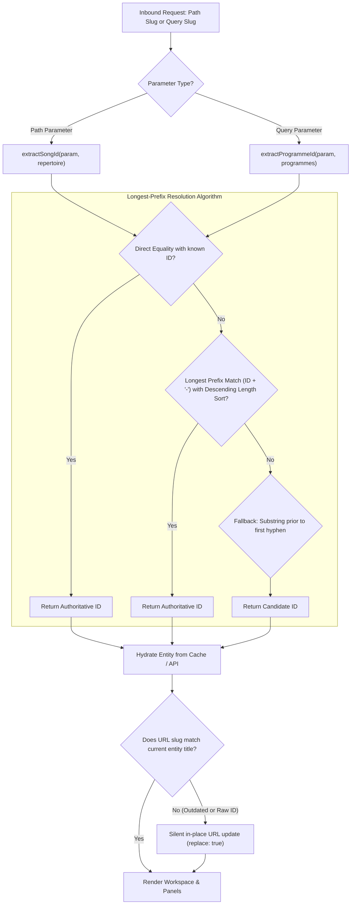

# Engineering Case Study 03: Resilient Hierarchical Routing & Self-Healing ID-Slug URLs

**Domain**: Frontend Routing, URL Design & SEO/UX Resilience  
**Technologies**: TypeScript, React Router v6, Regular Expressions, URLSearchParams  
**Impact**: Clean, human-readable URLs with diacritic transliteration; 100% link resilience against repertoire and programme renames; zero route explosion in composite multi-pane workbenches.  
**Code Reference**: [`snippets/routing-and-slug-architecture/slugUtils.ts`](../snippets/routing-and-slug-architecture/slugUtils.ts)

---

## 1. Context & The Problem

A choral songbook requires shareable, bookmarkable deep links for specific songs and concert setlists (e.g. conductors sending a WhatsApp message with the exact sheet music or running order for rehearsal).

Two naive approaches commonly fail in production:

1. **Opaque Database IDs (`/songs/s48194` or `/songs/64f8a12b...`)**:
   - Degraded UX: Users cannot tell what musical piece or concert setlist the link references prior to opening it.
   - Poor accessibility, confusing link previews, and high cognitive load.
2. **Pure Title Slugs (`/songs/bog-sie-rodzi`)**:
   - Fragile: If a conductor fixes a typo in the title or adds an arranger suffix (e.g., *"Bóg się rodzi (opr. Nowowiejski)"*), existing bookmarks and chat links **break immediately (404)**.
   - Slug Collisions: Distinct choral arrangements of classic repertoire share identical titles across liturgical seasons.

### The Composite Multi-Pane Routing Dilemma

In addition to deep-linking individual songs, conductors operate within a **composite multi-pane workbench**: simultaneously browsing the choir repertoire catalog, reading sheet music in the score reader, and arranging a concert programme in a side panel.

Attempting to model co-active tools with nested path routes (e.g. `/choir/:choirId/programmes/:progId/songs/:songId`) introduces severe architectural failure modes:
- **Route Explosion**: Combinatorial path nesting makes routing tables brittle and maintenance-heavy.
- **State Ejection**: Navigating between songs in the repertoire risks blowing away the active programme editor unless manually synchronized across complex route transitions.
- **Broken Navigation Chrome**: Naive path-prefix highlighting conflates auxiliary panel tools with top-level navigation sections.

---

## 2. The Solution: Dual-Paradigm Hybrid ID-Slug Routing

To solve both URL durability and multi-pane workbench composition, **echoir** implements a **dual-paradigm routing architecture**:

1. **Primary Entities (Route Path Parameters)**:  
   The primary visual entity in the viewport is routed via standard hierarchical path parameters:
   ```
   /choir/:choirId/songs/:songId-:titleSlug
   Example: /choir/c102/songs/s481-bog-sie-rodzi
   ```

2. **Contextual Auxiliary Tools (Search Query Parameters)**:  
   Secondary or co-active tools in the workbench (such as the concert programme manager or new setlist draft) are mounted via search query parameters that also employ hybrid ID-slugs:
   ```
   /choir/:choirId/songs?programme=:programmeId-:titleSlug
   Example: /choir/c102/songs?programme=12-koncert-wielkopostny
   Draft Example: /choir/c102/songs?programme=new
   ```

### State Preservation Invariant

When a user browses or selects songs in the repertoire while editing a concert programme, the application updates `location.pathname` while explicitly preserving active query parameters:

```typescript
// Selecting a song preserves the active programme builder pane
navigate({
  pathname: `/choir/${choirId}/songs/${getSongSlug(selectedSong)}`,
  search: searchParams.toString(),
});
```

Similarly, closing the programme panel removes the query parameter cleanly without ejecting the user from their active sheet music view.



---

## 3. Algorithmic Breakdown & Transliteration

### A. Polish Diacritics Transliteration & Normalization
Choral repertoires contain extensive multilingual titles with accented characters (`ą`, `ć`, `ę`, `ł`, `ń`, `ó`, `ś`, `ź`, `ż`). The `slugify()` utility performs high-performance mapping to ASCII equivalents:

```typescript
export function slugify(input: string): string {
  if (!input) return "";

  const diacriticMap: Record<string, string> = {
    ą: "a", ć: "c", ę: "e", ł: "l", ń: "n",
    ó: "o", ś: "s", ź: "z", ż: "z",
    Ą: "a", Ć: "c", Ę: "e", Ł: "l", Ń: "n",
    Ó: "o", Ś: "s", Ź: "z", Ż: "z",
  };

  let normalized = input.replace(/[ąćęłńóśźżĄĆĘŁŃÓŚŹŻ]/g, (char) => diacriticMap[char] || char);
  normalized = normalized.toLowerCase();
  normalized = normalized.replace(/[^a-z0-9]+/g, "-");
  normalized = normalized.replace(/-+/g, "-").replace(/^-+|-+$/g, "");

  return normalized;
}
```

### B. Longest-Prefix Collision Resistance
When matching candidate IDs against the loaded repertoire or programme list, candidate entities are sorted by **descending string length**. This invariant prevents shorter IDs from falsely matching substrings of longer IDs (for instance, preventing ID `s1` from prematurely capturing `s10-kyrie`):

```typescript
export function extractProgrammeId(
  param: string | undefined,
  programmes?: readonly ProgrammeRouteEntity[]
): string | null {
  if (!param) return null;
  if (param === "new") return "new";

  if (programmes && programmes.length > 0) {
    // 1. Direct equality check
    const directMatch = programmes.find(
      (p) => p.id !== undefined && String(p.id) === param
    );
    if (directMatch && directMatch.id !== undefined) return String(directMatch.id);

    // 2. Longest-prefix match sorted by ID length descending
    const prefixMatch = [...programmes]
      .filter((p) => p.id !== undefined && p.id !== null)
      .sort((a, b) => String(b.id).length - String(a.id).length)
      .find((p) => param.startsWith(`${String(p.id)}-`));
    if (prefixMatch && prefixMatch.id !== undefined) return String(prefixMatch.id);

    // 3. Known entity candidate lookup via prefix substring
    const dashIdx = param.indexOf("-");
    if (dashIdx !== -1) {
      const candidateId = param.substring(0, dashIdx);
      const candidateMatch = programmes.find(
        (p) => p.id !== undefined && String(p.id) === candidateId
      );
      if (candidateMatch && candidateMatch.id !== undefined) return String(candidateMatch.id);
    }
  }

  // Fallback when entities are not yet loaded in cache
  const fallbackDashIdx = param.indexOf("-");
  return fallbackDashIdx !== -1 ? param.substring(0, fallbackDashIdx) : param;
}
```

---

## 4. Self-Healing Canonical URL Synchronization

When a user visits a stale link or enters a raw database ID (e.g. `/choir/c102/songs?programme=12` or `/choir/c102/songs/s481-old-title`), the routing layer auto-canonicalizes the URL in-place:

1. **Path Slugs**:
   - The route loader resolves `songId: "s481"`.
   - The canonical slug `/choir/c102/songs/s481-gaude-mater` is generated.
   - The browser updates silently via `history.replaceState()`, preserving the user's back-button stack.

2. **Query Parameter Slugs**:
   - The songbook component detects `programmeParam === "12"` while the loaded setlist has title *"Koncert Wielkopostny"*.
   - A canonical query string is assembled: `?programme=12-koncert-wielkopostny`.
   - React Router executes `navigate({ search: canonicalSearch }, { replace: true })`, updating the address bar without remounting components or re-fetching data.

---

## 5. Summary of Achievements

- **Zero 404s on Renamed Repertoire & Setlists**: Historical links and bookmarks resolve permanently regardless of title edits or arrangement changes.
- **Multi-Pane Workbench State Preservation**: Auxiliary tool panels remain mounted with active state while switching primary songs, eliminating accidental state loss.
- **Human-Readable Chat & Social Previews**: URLs shared on WhatsApp, Slack, or email immediately communicate musical context.
- **Zero-`any` Deterministic Implementation**: Pure TypeScript utility functions tested against international diacritics, hyphen collisions, and draft keywords.
