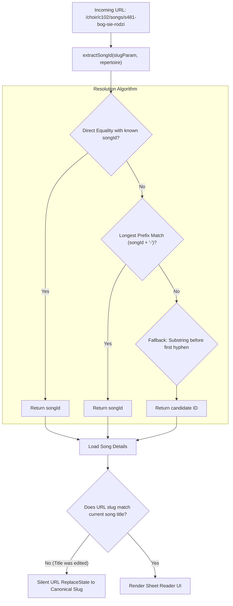

# Engineering Case Study 03: Resilient Hierarchical Routing & Self-Healing ID-Slug URLs

**Domain**: Frontend Routing, URL Design & SEO/UX Resilience  
**Technologies**: TypeScript, React Router v6, Regular Expressions  
**Impact**: Clean, human-readable URLs with diacritic transliteration; 100% link resilience against repertoire renames.

---

## 1. Context & The Problem

A choral songbook requires shareable, bookmarkable deep links for specific songs (e.g. conductors sending a WhatsApp message with the exact sheet music for rehearsal).

Two naive approaches commonly fail in production:
1. **Opaque Database IDs (`/songs/s48194` or `/songs/64f8a12b...`)**:
   - Terrible UX: Users cannot tell what piece of music the link refers to.
   - Poor accessibility and cognitive load.
2. **Pure Title Slugs (`/songs/bog-sie-rodzi`)**:
   - Brittle: If a conductor edits a typo in the title or adds an arranger suffix (e.g., *"Bóg się rodzi (opr. Nowowiejski)"*), existing bookmarks and chat links **break immediately (404)**.
   - Slug Collisions: Different arrangements of standard choral works share identical titles.

---

## 2. The Solution: Hybrid ID-Slug URLs with Longest-Prefix Matching

**echoir** implements a **hybrid self-healing ID-slug routing strategy**:
```
/choir/:choirId/songs/:songId-:titleSlug
Example: /choir/c102/songs/s481-bog-sie-rodzi
```



---

## 3. Algorithmic Breakdown & Transliteration

### A. Polish Diacritics Transliteration & Normalization
Choral repertoires contain extensive multilingual titles with accented characters (`ą`, `ć`, `ę`, `ł`, `ń`, `ó`, `ś`, `ź`, `ż`). The `slugify()` utility performs high-performance mapping:

```typescript
export function slugify(input: string): string {
  if (!input) return "";

  const diacriticMap: Record<string, string> = {
    ą: "a", ć: "c", ę: "e", ł: "l", ń: "n",
    ó: "o", ś: "s", ź: "z", ż: "z",
    Ą: "a", Ć: "c", Ę: "e", Ł: "l", Ń: "n",
    Ó: "o", Ś: "s", Ź: "z", Ż: "z",
  };

  let normalized = input.replace(/[ąćęłńóśźżĄĆĘŁŃÓŚŹŻ]/g, (char) => diacriticMap[char] || char);
  normalized = normalized.toLowerCase();
  normalized = normalized.replace(/[^a-z0-9]+/g, "-");
  normalized = normalized.replace(/-+/g, "-").replace(/^-+|-+$/g, "");

  return normalized;
}
```

### B. Longest-Prefix Collision Resistance
When matching candidate IDs against the song database, IDs are sorted by descending string length. This prevents shorter IDs from falsely matching substrings of longer IDs:

```typescript
export function extractSongId(param: string | undefined, songs?: SongAPI[]): string | null {
  if (!param) return null;

  if (songs && songs.length > 0) {
    // 1. Direct equality
    const directMatch = songs.find((s) => s.songId === param);
    if (directMatch) return directMatch.songId;

    // 2. Longest prefix match against known repertoire
    const prefixMatch = [...songs]
      .sort((a, b) => b.songId.length - a.songId.length)
      .find((s) => param.startsWith(`${s.songId}-`));
    if (prefixMatch) return prefixMatch.songId;
  }

  // 3. Fallback when repertoire list is hydrating in background
  const dashIdx = param.indexOf("-");
  return dashIdx !== -1 ? param.substring(0, dashIdx) : param;
}
```

---

## 4. Self-Healing Canonical URL Synchronization

When a user visits a stale link (e.g. `/choir/c102/songs/s481-old-title`), the router:
1. Resolves `songId: "s481"`.
2. Fetches the updated song record whose title is now *"Gaude Mater"*.
3. Generates the canonical URL `/choir/c102/songs/s481-gaude-mater`.
4. Silently updates browser history via `history.replaceState()`, preserving the user's back-button stack without re-triggering network requests.

---

## 5. Summary of Achievements

- **Zero 404s on Renamed Repertoire**: Old bookmarks continue to work indefinitely.
- **Human-Readable Previews**: Link previews in messaging apps (Slack, WhatsApp, Discord) display the song name clearly in the URL.
- **Deterministic Pure Function Design**: 100% code coverage achieved via unit tests covering international diacritics, punctuation edge cases, and hyphen collisions.
