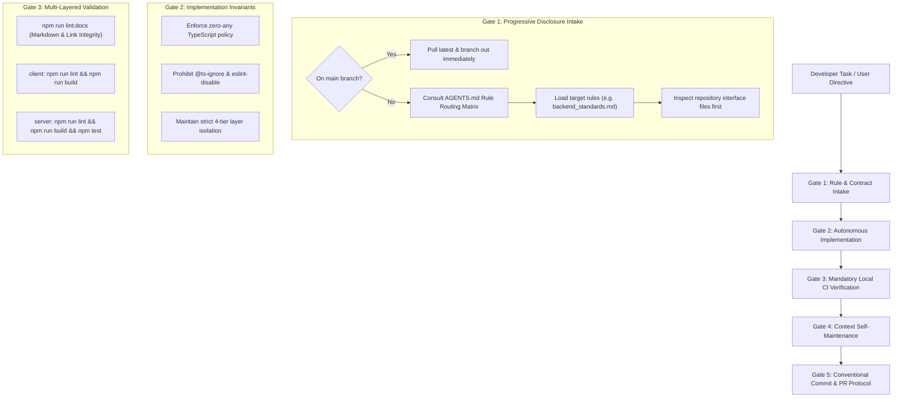

# 04. AI-Augmented Systems Engineering & Agent Governance

> **Focus Area**: AI Systems Architecture, Engineering Productivity & Quality Assurance  
> **Key Concepts**: Progressive Disclosure, Deterministic Path Triggering, 5-Phase Operational Gates, Zero-Drift Governance, Upstream Provenance Tracking  
> **Subsystem**: Monorepo Root (`AGENTS.md`, `.agents/`) & CI/CD Pipelines  

---

## 1. Context & The Production AI Challenge

As modern software development shifts toward AI augmentation, engineering teams face a stark dilemma: **how to leverage autonomous AI coding assistants for 5x–10x velocity without degrading codebase quality, introducing subtle security vulnerabilities, or suffering architectural drift.**

In the early stages of **echoir**, the foundational architecture was designed and implemented completely by hand:
- Establishing the strict 4-tier MVC/Repository backend abstraction.
- Writing the core MongoDB collections, indexes, and concurrency collision guards.
- Designing the custom React context workspace providers and hierarchical routing.

Once these architectural baselines were solid, development transitioned to an **AI-augmented engineering model**, pairing with autonomous AI coding agents (Antigravity) to implement features, refactor components, and ingest repertoire data.

### The Failure Modes of Naive AI Development ("Vibe Coding")
Without rigorous governance, unconstrained LLM code generation quickly leads to technical decay:
1. **Context Window Saturation & Hallucination**: Giant monolithic prompts dilute the agent's attention, causing it to hallucinate non-existent packages or misremember function signatures.
2. **Architectural Boundary Erosion**: Agents frequently take shortcuts—such as calling MongoDB collections directly from HTTP controllers, bypassing domain service validation.
3. **Compiler Suppression Hacks**: When encountering complex TypeScript errors, unconstrained agents often insert `@ts-ignore` or `any` casts to force CI to pass.
4. **Instruction Blindness**: When given 50+ lines of conflicting markdown instructions, LLMs selectively drop edge-case constraints.

To eliminate these failure modes, **echoir** pioneered a deterministic **Agent Governance Architecture** centered on progressive disclosure, machine-readable path triggers, and strict operational gates.

---

## 2. Architectural Design & The 5-Phase Lifecycle Gate

The governance engine decouples AI instructions into a lightweight, progressive hierarchy that mirrors high-standard engineering team guidelines:



---

## 3. Key Governance Decisions & Mechanisms

### 1. Progressive Disclosure Context Architecture
Rather than overloading the AI agent's initial prompt with thousands of lines of documentation, the repository implements a strict 3-tier progressive context hierarchy:

```
AGENTS.md (< 140 lines)           [Tier 1: Master Entry Point & High-Level Matrix]
   │
   ├── .agents/acs.yaml            [Tier 2: Machine-Readable Path Triggers]
   │
   └── .agents/rules/              [Tier 3: Modular Domain Rules & Anti-Pattern Traps]
       ├── backend_standards.md
       ├── frontend_standards.md
       ├── typescript_standards.md
       └── git_and_pr_standards.md
```

- **Tier 1 (`AGENTS.md`)**: The root file acts as an air-traffic controller. It contains *only* the architecture overview, core CLI commands, and a **Mandatory Rule Routing Matrix** mapping target file paths to specific rule files.
- **Tier 2 (`.agents/acs.yaml`)**: An Agent Configuration Schema defining exact glob patterns (`trigger_paths`) that trigger rules automatically when specific subsystems are modified.
- **Tier 3 (`.agents/rules/*.md`)**: High-density declarative standards containing positive "golden patterns" and an **Anti-Pattern & Pitfall Traps Table** highlighting exact failure modes.

### 2. Contract-First Interface Inspection (Preventing the Parameter Swap Bug)
A notorious failure mode of AI coding agents is guessing parameter orders when calling backend methods (e.g., calling `repository.findByUser(choirId, userId)` instead of `(userId, choirId)`).

**echoir** codified an absolute invariant in Gate 1:
> *Whenever invoking or implementing a service or repository method, the agent MUST inspect the TypeScript interface file in `interfaces/` first using `view_file`.*

This simple, deterministic rule eliminated parameter-transposition bugs across all multi-tenant database operations.

### 3. Strict Compiler & Zero-Suppression Policy
The agent is explicitly forbidden by operational rules from using compiler suppression comments:
- No `// @ts-ignore` or `// @ts-expect-error`
- No `/* eslint-disable */`
- Zero `any` types

If a type error occurs, the agent is forced to resolve the root typing mismatch in domain models or DTOs rather than sweeping it under the rug.

### 4. Autonomous Browser Verification via Playwright Daemon
For complex interactive features (multi-page PDF splitting, responsive sheet reader navigation, audio stem playback), unit tests alone are insufficient.

The project equips agents with a dedicated background Playwright daemon (`playwright-cli`). Agents autonomously:
1. Spin up the client and server instances.
2. Log into active test sessions with test credentials.
3. Perform end-to-end user workflows (e.g. uploading a score, verifying that PDF.js splits pages correctly, inspecting canvas thumbnails, and verifying audio waveforms).
4. Capture high-resolution DOM snapshots and network logs to verify state before committing code.

### 5. Deterministic Upstream Version Tracking
To ensure that `echoir-showcase` stays synchronized with the proprietary `echoir` repository, the showcase tracks exact upstream commit hashes in [`.agents/project_context.md`](../.agents/project_context.md). Whenever upstream introduces architectural milestones, agents use the [`sync-from-upstream`](../.agents/skills/sync-from-upstream/SKILL.md) skill to inspect diffs (`git log <hash>..HEAD`), sanitize code samples, and advance the tracked provenance hash.

---

## 4. Measurable Outcomes & ROI

| Metric | Hand-Crafted Alone | AI-Augmented with Governance | Impact |
| :--- | :---: | :---: | :--- |
| **Feature Velocity** | Baseline (~1–2 PRs / week) | **10–15 PRs / week** | **~7× acceleration** in delivery speed |
| **Type Safety & Zero-`any`** | 100% | **100% maintained** | Zero regression in typing rigor across 200+ PRs |
| **CI Build Failure Rate** | ~8% (transient oversights) | **< 1%** | Pre-push local CI gates catch failures before pushing |
| **Architectural Layer Leakage** | Zero (guarded manually) | **Zero (guarded deterministically)** | Controllers never bypass services or leak MongoDB primitives |
| **Documentation Parity** | Drifted over time | **Continuously updated** | Gate 4 forces `.agents/` context self-maintenance on every PR |

---

## 5. Architectural Summary

Transitioning from manual coding to an **AI-Augmented Systems Engineering** workflow did not mean relinquishing architectural ownership. On the contrary, it required elevating engineering discipline from writing individual loops and queries to **architecting deterministic systems, constraints, and verification protocols** that guide autonomous agents to build production-grade software reliably.
