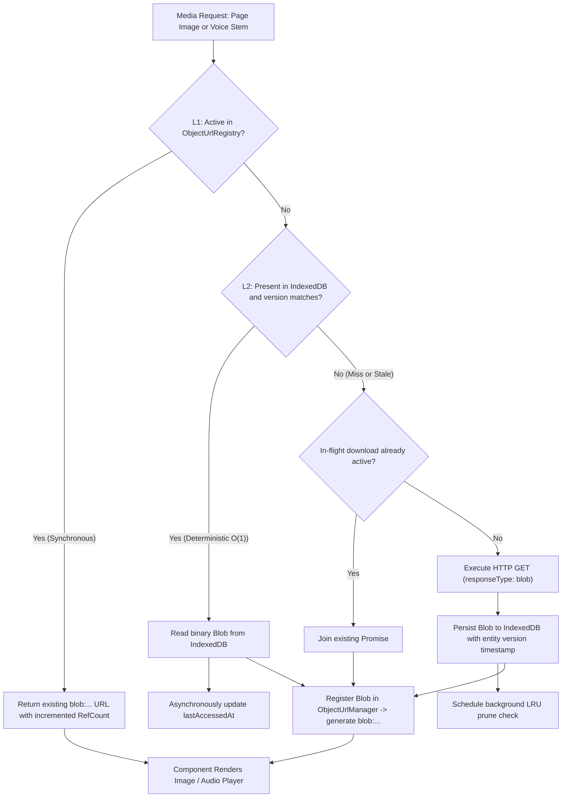
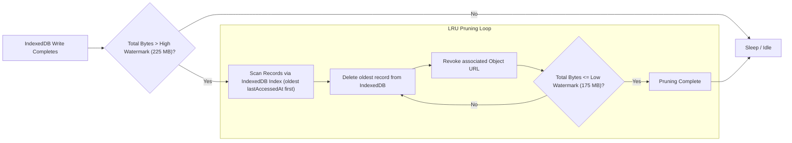

# Engineering Case Study 05: Persistent Client-Side Media Caching & Deterministic Blob Memory Management

**Domain**: Client-Side Systems Engineering, Browser Offline Storage, Binary Data Pipelines & Heap Memory Management  
**Technologies**: TypeScript, IndexedDB (`idb`), Object URLs (`URL.createObjectURL`, `URL.revokeObjectURL`), `requestIdleCallback`, React 18 Hooks  
**Impact**: Sub-5ms instantaneous page flips during live choral performances; zero-latency vocal stem playback; 100% offline resilience for rehearsed setlists; zero browser heap memory leaks.  
**Code References**: [`snippets/persistent-media-cache/fileCacheService.ts`](../snippets/persistent-media-cache/fileCacheService.ts), [`snippets/persistent-media-cache/objectUrlManager.ts`](../snippets/persistent-media-cache/objectUrlManager.ts)

---

## 1. Context & The Physical Reality of Rehearsal Spaces

Vocal ensembles, choirs, and conductors regularly rehearse and perform in challenging physical environments:
- Thick-walled medieval cathedrals, vaulted stone sanctuaries, and community basements act as cellular Faraday cages with near-zero mobile reception.
- Congested guest Wi-Fi networks in performance venues degrade or drop connections under hundreds of concurrent attendee connections.
- In-flight or touring travel demands rehearsal mode without network access.

In choral music workflows, sheet music scores and multi-track audio recordings represent substantial binary payloads:
- A 40-page sacred choral score rendered at high DPI for Retina screens comprises 20–40 MB of compressed image assets.
- A 4-part polyphonic motet (Soprano, Alto, Tenor, Bass stems) represents 30–50 MB of uncompressed audio.

If an application depends on real-time HTTP requests to fetch page $N+1$ as a singer turns the page mid-measure, a dropped packet or a 1.5-second network stall halts the rehearsal. Furthermore, naively downloading hundreds of megabytes of media into browser heap memory causes memory pressure, sluggish garbage collection pauses, and browser tab crashes on mobile devices and rehearsal tablets (e.g. iPads).

---

## 2. The Solution: Multi-Tier Offline Storage & Memory Architecture

To deliver guaranteed zero-latency performance while bounding browser memory consumption, **echoir** implements a **4-tier client-side binary media storage pipeline**:



### Storage Tiers Explained

1. **L1 In-Memory Object URL Registry (`objectUrlManager`)**:
   - Synchronous, in-memory reference-counted mapping of cache keys to browser-allocated `blob:...` URIs.
   - Serves immediate re-renders with zero asynchronous microtasks.
2. **L2 Persistent Device Storage (`IndexedDB`)**:
   - Structured persistent database using the native browser IndexedDB engine.
   - Stores raw binary `Blob` objects directly in device storage, surviving browser restarts and page refreshes.
   - Indexed by composite primary keys (`mediaType:songId:itemIdentifier`), with secondary indexes on `songId`, `choirId`, and `lastAccessedAt`.
3. **L3 Proactive Lookahead Prefetch Queue (`prefetchService`)**:
   - Idle-time background scheduler utilizing `requestIdleCallback`.
   - Proactively downloads and caches adjacent pages $(N-1, N+1, N+2)$ and vocal stems before the user navigates to them.
4. **L4 Authoritative Remote REST API**:
   - Cloud storage media streaming endpoints with in-flight Promise deduplication to collapse duplicate concurrent requests into a single network transfer.

---

## 3. Browser Memory Lifecycle Management & Zero-Leak Object URLs

A primary pitfall of client-side binary media in web applications is the mismanagement of `URL.createObjectURL()`.

### The Problem: Silent Heap Memory Exhaustion

When `URL.createObjectURL(blob)` is called, the browser creates an internal reference binding the underlying `Blob` directly to the document's origin in native heap memory. This memory **cannot be collected by the JavaScript garbage collector** until:
1. `URL.revokeObjectURL(url)` is explicitly called, or
2. The entire browser tab document unloads.

In a single-page application where conductors navigate through dozens of 30-page scores over a 3-hour rehearsal, naive Object URL allocation leaks hundreds of megabytes of raw images into the heap. On memory-constrained devices (such as an iPad with 3–4 GB of unified RAM), this causes the operating system to silently terminate the web process (browser crash).

### The Solution: Reference-Counting with Delayed Grace-Period Eviction

To eliminate leaks without causing visual UI flickering, `echoir` implements a deterministic reference-counted lifecycle manager:

```typescript
// From snippets/persistent-media-cache/objectUrlManager.ts
interface ObjectUrlEntry {
  readonly url: string;
  refCount: number;
  cleanupTimer?: ReturnType<typeof setTimeout>;
}

const registry = new Map<string, ObjectUrlEntry>();
const REVOCATION_GRACE_PERIOD_MS = 3000;

export function acquireObjectUrl(cacheKey: string, blob: Blob): string {
  const existing = registry.get(cacheKey);

  if (existing) {
    // If pending deferred revocation, cancel the timer and reuse URL
    if (existing.cleanupTimer !== undefined) {
      clearTimeout(existing.cleanupTimer);
      existing.cleanupTimer = undefined;
    }
    existing.refCount += 1;
    return existing.url;
  }

  const url = URL.createObjectURL(blob);
  registry.set(cacheKey, { url, refCount: 1 });
  return url;
}

export function releaseObjectUrl(cacheKey: string): void {
  const entry = registry.get(cacheKey);
  if (!entry) return;

  entry.refCount -= 1;

  if (entry.refCount <= 0) {
    // Defer revocation to prevent flickering during React 18 StrictMode remounts
    entry.cleanupTimer = setTimeout((): void => {
      URL.revokeObjectURL(entry.url);
      registry.delete(cacheKey);
    }, REVOCATION_GRACE_PERIOD_MS);
  }
}
```

### Why the 3-Second Grace Period is Critical

React 18 introduced concurrent rendering and StrictMode lifecycle behaviours where components mount, unmount, and remount in rapid succession during dev verification and layout transitions.

If `URL.revokeObjectURL` were called synchronously on unmount:
1. The component unmounts; the Object URL is revoked immediately.
2. The remounted component attempts to render the revoked URL, causing broken image icons (`net::ERR_FILE_NOT_FOUND`) or stalled audio contexts.
3. The application is forced to re-read the Blob from IndexedDB and allocate an entirely new Object URL, degrading frame rates.

The 3-second grace period guarantees that if a component remounts or swiping users quickly glance back at a previous page, the existing URL is reclaimed instantly with zero memory re-allocation.

---

## 4. Deterministic O(1) Cache Freshness & Storage Quota Eviction

### Eliminating HTTP 304 Roundtrips

Traditional HTTP caching relies on `ETag` and `If-None-Match` headers, requiring an asynchronous roundtrip to the server to receive a `304 Not Modified` status. In spotty church basements, waiting 800ms for a `304` is unacceptable.

In **echoir**, every song and audio recording in the database contains an authoritative Unix update timestamp (`updateTime`). When TanStack Query loads the song metadata, the cache engine performs a **zero-network deterministic comparison**:

```typescript
const isCached = await isMediaCached(type, songId, itemIdentifier, song.updateTime);
```

- If `record.version === song.updateTime`, the file on disk is guaranteed to be identical to production. It is served instantly from local storage with **zero HTTP network requests**.
- If a conductor uploads a corrected score or a revised Soprano stem, `song.updateTime` changes. The cache engine detects the version mismatch, downloads the updated file, overwrites the IndexedDB record, and automatically revokes old Object URLs.

### Dual-Watermark LRU Storage Pruner

Mobile browser storage quotas vary across operating systems (typically between 500 MB and 10% of free disk space). To prevent quota exceeded errors (`QuotaExceededError`), the engine enforces a strict dual-watermark policy:

- **Hard Quota Limit**: 250 MB.
- **High Watermark Trigger**: 90% (225 MB).
- **Low Watermark Target**: 70% (175 MB).



---

## 5. Proactive Lookahead Slide Prefetching

In performance mode, singers swipe or use Bluetooth pedal turners to turn pages. To guarantee that turning to the next page never displays a loading spinner, the `SongBox` component dispatches low-priority prefetch tasks ahead of user action:

```typescript
// Prefetch adjacent pages: current page + 1, current page + 2, and previous page
const prefetchTasks: PrefetchTask[] = [];

if (imageIndex + 1 < currentSong.imagesCount) {
  prefetchTasks.push({
    songId: currentSong.songId,
    type: "image",
    itemIdentifier: imageIndex + 1,
    version: currentSong.updateTime,
    fallbackUrl: getSongImageURL(currentSong.songId, imageIndex + 1),
    priority: "high",
  });
}
if (imageIndex + 2 < currentSong.imagesCount) {
  prefetchTasks.push({
    songId: currentSong.songId,
    type: "image",
    itemIdentifier: imageIndex + 2,
    version: currentSong.updateTime,
    fallbackUrl: getSongImageURL(currentSong.songId, imageIndex + 2),
    priority: "low",
  });
}

queuePrefetch(prefetchTasks);
```

The prefetch queue executes via `window.requestIdleCallback`, utilizing CPU idle slices so score preloading never competes with 60fps swipe animations or Web Audio decoding threads.

---

## 6. User Diagnostics & Storage Telemetry

Users maintain complete transparency and agency over local device storage through an administrative diagnostic card located in **Account Settings**:

- **Real-Time Storage Telemetry**: Computes exact byte breakdown between sheet music page images and vocal stem audio recordings via the `useCacheStats()` hook.
- **One-Click Cache Purge**: A single action immediately clears IndexedDB stores and calls `revokeAllObjectUrls()` to return memory to the OS.
- **Scoped Invalidation**: Whenever a conductor edits a song or deletes a choir workspace, targeted cascade invalidations (`invalidateSong`, `invalidateChoir`) purge relevant records without requiring full cache wipes.

---

## 7. Summary of Achievements

- **Zero-Latency Live Rehearsals**: Sheet music pages flip instantly (< 5ms) from persistent device storage, completely independent of venue connectivity.
- **Guaranteed Browser Heap Bounds**: Reference-counted Object URL tracking prevents memory leaks, keeping browser memory usage stable even after hours of continuous score reading.
- **Resilient Offline Architecture**: Once loaded, concert setlists remain fully accessible in airplane mode or deep basements.
- **Zero ORM Overhead**: Direct, performant IndexedDB schema interactions combined with pure, type-safe TypeScript interfaces.
